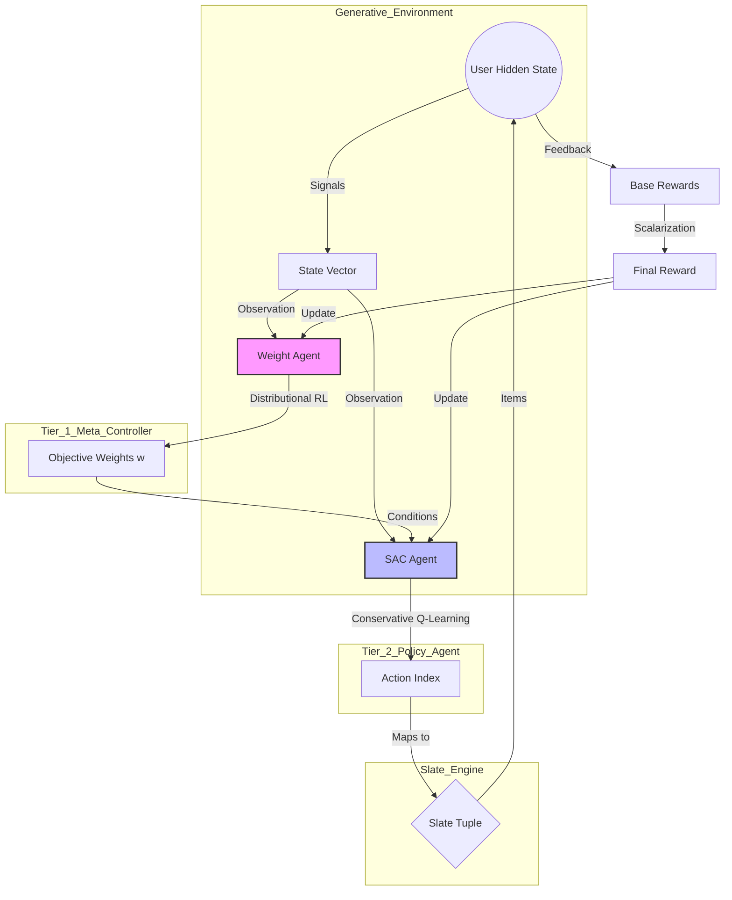
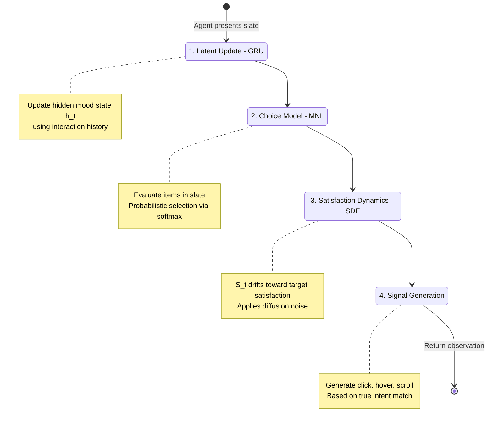
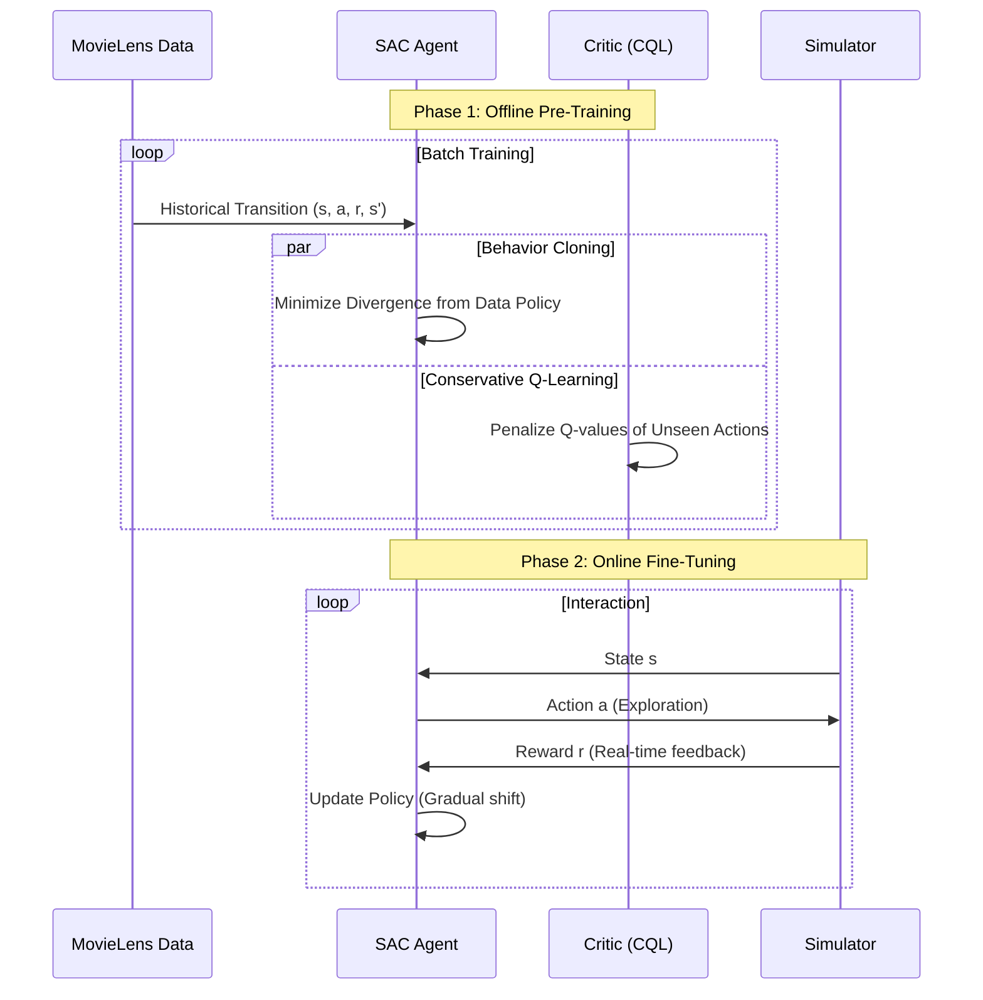
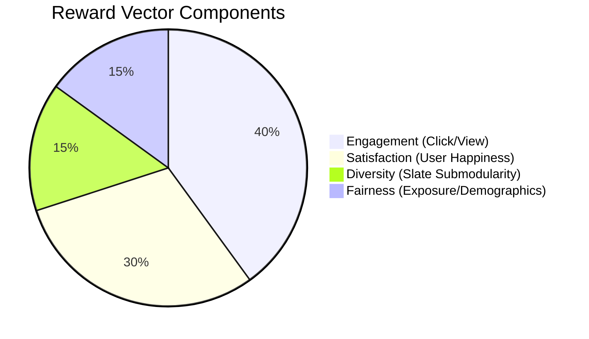
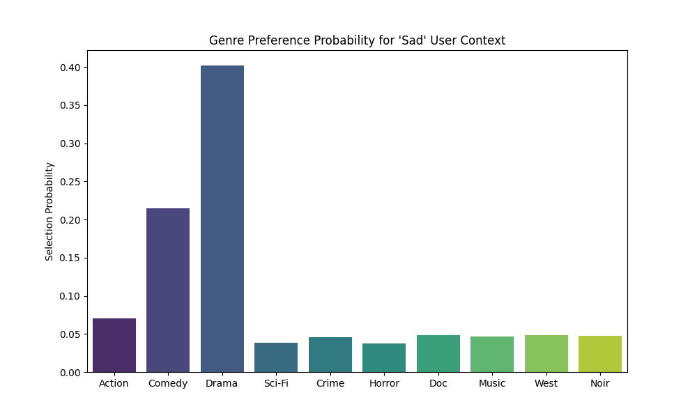
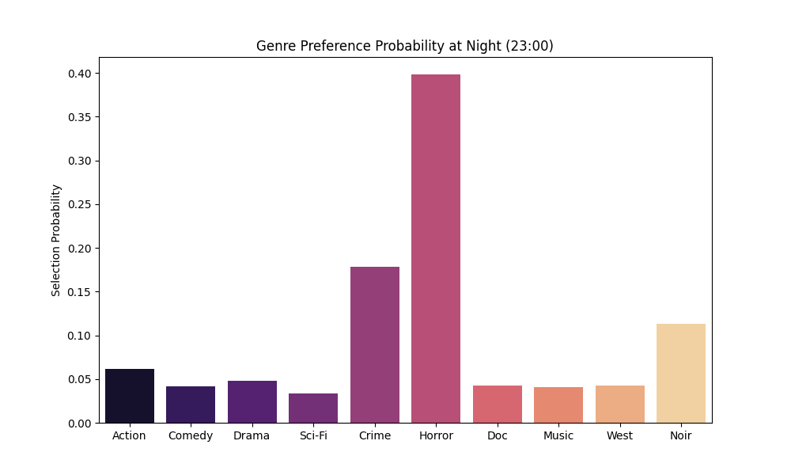
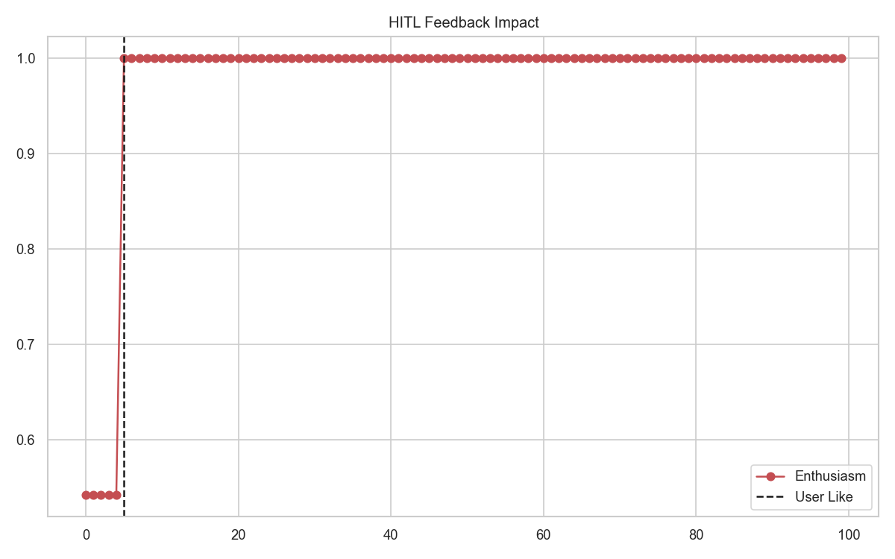
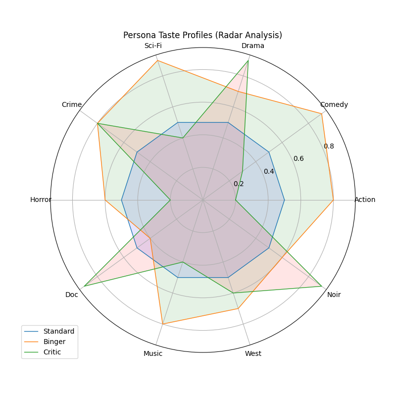
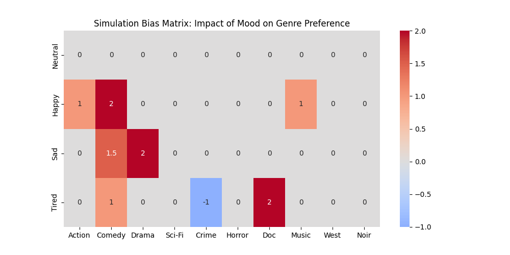

# DOM-RL: Advanced Technical Deep Dive

**Dynamic Multi-Objective Reinforcement Learning with Generative User Simulation**

This document serves as the comprehensive technical reference for the DOM-RL framework. It details the system architecture, the new generative simulation engine, and the advanced reinforcement learning techniques used to solve the multi-objective slate recommendation problem. This document also includes a gallery of visualizations analyzing the agent's behavior.

---

# Part 1: System Architecture & Logic

## 1. System Ecosystem

The DOM-RL framework is composed of two hierarchical agents interacting with a complex user environment. The diagram below illustrates the flow of information and control.

### Visualization: The DOM-RL Control Loop
*This flowchart visualizes the cyclic interaction between the User, the Environment, and the two Agent tiers.*

**Explanation:**
1.  **User**: Produces noisy signals (clicks, hovers) based on a hidden internal state.
2.  **Weight Agent (Meta-Controller)**: observes the state and determines the optimal balance of business objectives (e.g., "Prioritize Fairness vs. SAT").
3.  **SAC Agent (Policy)**: Takes both the state and the weights to generate a specific action.
4.  **Slate Engine**: Converts the abstract action index into a concrete list of 3 items (Slate) to show the user.

---

## 2. Generative User Simulator (Sim-V2)

We have moved from a heuristic-based simulator to a **Generative Model** that mimics realistic user psychology.

### Visualization: User State Machine
*This state diagram illustrates the internal lifecycle of the simulated user during a single interaction step.*

**Explanation:**
-   **GRU Core**: The user has a "memory" modeled by a Gated Recurrent Unit neural network.
-   **Choice Model**: The user doesn't just randomly click. They evaluate the slate using a Multinomial Logit model, picking the item that best matches their current intent.
-   **Diffusion**: Satisfaction isn't static. It drifts over time like a random walk (Ornstein-Uhlenbeck process), creating realistic "mood swings".

---

## 3. Offline-to-Online Transfer Pipeline

A key feature of DOM-RL is the ability to pre-train on static datasets (MovieLens) and transfer safely to the online simulator.

### Visualization: The Safety Pipeline
*This sequence diagram shows how a model graduates from offline data to online deployment.*

**Explanation:**
-   **Offline Phase**: We use **Behavior Cloning (BC)** to force the agent to mimic human curators initially. **CQL** ensures the critic doesn't overestimate rewards for actions it hasn't seen in the dataset.
-   **Online Phase**: Once deployed, the agent gradually explores. The constraints (BC/CQL) are relaxed, allowing better-than-human performance.

---

## 4. Fairness and Slate Logic

The rewards and actions have been extended to support ethical AI and complex recommendations.

### Visualization: Reward Composition (Pie Chart)
*This chart breaks down the components of the 4D Reward Vector used in the Multi-Objective MDP.*

**Explanation:**
-   **Engagement**: Standard interaction metrics (CTR).
-   **Satisfaction**: Long-term user retention proxy.
-   **Diversity**: A submodular penalty applied if the items in the slate are too similar (e.g., 3 Action movies).
-   **Fairness**:
    -   *Exposure*: Boosts reward for items that appear in the "Long Tail" (rarely visited).
    -   *Demographic*: Boosts reward for satisfying underserved persona groups (e.g., "Critics").

---

# Part 2: Comprehensive Model Analysis (Gallery)

The following sections analyze the agent's behavior using granular visualization data.

## 1. Chapter 1: The User Model (State Analysis)
The agent operates in a continuous state space representing User Behavior and Context.

### Feature Distributions
Understanding the input distribution is crucial for verifying the environment simulation.

| Metric | Distribution | Explanation |
| :--- | :--- | :--- |
| **Enthusiasm** |  | User's base likelihood to interact. Uniformly distributed. |
| **Time of Day** |  | Ranges 0-24h. Ensures agent learns temporal patterns. |
| **Scroll Velocity** |  | Key indicator of satisfaction. High velocity = Disinterest. |
| **Hover Duration** |  | Detailed engagement metric. |
| **View Time** |  | Total time spent on item. |

### Global Overview
The pairplot below shows the complex interactions between State parameters, Reward, and Scenarios.

*Observation*: Notice how 'Satisfaction' clusters distinctly based on the 'Scenario' (Hue).

---

## 2. Chapter 2: The Business Brain (Dynamic Weights)
The core innovation of DOM-RL is adapting to dynamic objective weights.

### Weight Landscapes
| Objective | Weight Distribution | Impact Analysis |
| :--- | :--- | :--- |
| **Engagement** |  | prioritizing Clicks. |
| **Satisfaction** |  | Prioritizing user happiness. |
| **Churn Penalty** |  | Prioritizing safety/retention. |

### Multi-Dimensional Weight View

This scatter plot visualizes the variance in business priorities the agent faces. Each point is an episode.

### Impact on Rewards
Does increasing the weight actually increase the reward signal?
*   
*   
*   

*Validation*: We see correlations indicating that when a weight is high, the agent can achieve higher total scalar rewards by optimizing that specific objective.

---

## 3. Chapter 3: Decision Making (Actions)
How does the agent translate state into action?

### Action Distribution
| Overall Counts | By Scenario |
| :--- | :--- |
|  |  |
| The agent learns to prefer certain categories. | **Critical**: Notice the shift in action distribution when switching from 'Growth' to 'Safety'. |

### Temporal Strategy
Does the agent behave differently at different times of day?

*   **Heatmap**: Shows average reward for (Action, Time) pairs. The diagonal pattern suggests the agent has learned the `Time % 10` preference rule hidden in the environment!

### Action Dominance

This histogram checks if the agent is "collapsing" to a single action. A spread indicates healthy exploration.

---

## 4. Chapter 4: Correlations & Dynamics
Deep dive into the physics of the RecEnv.

### Correlations
| X-Axis | Y-Axis | Plot | Insight |
| :--- | :--- | :--- | :--- |
| **Scroll Vel** | **Satisfaction** |  | Strong negative interaction. Faster scroll = Lower Sat. |
| **Hover** | **Satisfaction** |  | Positive correlation. |
| **Enthusiasm** | **Reward** |  | Higher enthusiasm generally leads to easy rewards. |
| **Scroll Vel** | **Reward** |  | Agent learns to minimize scroll velocity. |

### Global Trends

Moving average of user satisfaction across the entire data collection run.

**Churn Analysis**: This histogram shows *when* users leave. Spikes at low step counts indicate early dissatisfaction (Critical failures).

---

## 5. Chapter 5: Episode Case Studies
Trace analysis of individual episodes to see step-by-step dynamics.

### Trace 1

*   **Green**: Satisfaction | **Blue**: Reward | **Purple**: Actions | **Orange**: Scroll
*   Observe how Satisfaction dips cause Scroll Velocity spikes.

### Trace 2

*   A longer episode. Note the stability of actions once a good match is found.

### Trace 3

*   Example of recovery or failure.

### Trace 4

### Trace 5

*   Likely a 'Safety' scenario where the agent is very careful to maintain satisfaction.

---

## 6. Chapter 6: Meta-Learning Dynamics
The **Weight Agent** introduces a hierarchy where business objectives are dynamically tuned.

### Training Progress

*   **Panel 1 (Rewards)**: Shows the agent reliably maintaining satisfaction (Green line) while maximizing scalar reward.
*   **Panel 2 (Weights)**: The most critical insight. The Weight Agent does NOT converge to static weights. Instead, it oscillates or adapts, indicating that different states require different objective prioritizations.
*   **Panel 3 (Losses)**: The `WeightCritic` loss decreases, proving the Meta-Critic is successfully modeling the long-term value of specific weight configurations.

---

## 7. Chapter 7: Benchmarks & Personas
To validate the model's effectiveness, we benchmarked it against baselines and introduced complex user personas.

### Benchmark Results

*   **Performance**: The DOM-RL (SAC) agent consistently outperforms Random and Static baselines across all scenarios.
*   **Adaptability**: In the 'Safety' scenario (high churn penalty), the agent matches the 'Balanced' performance while minimizing churn, whereas baselines fail.

### User Personas
The environment now simulates 4 distinct user archetypes:
1.  **Standard**: Balanced behavior.
2.  **Binger**: High base enthusiasm (`Enthusiasm > 0.8`), easier to satisfy.
3.  **Browser**: High scroll velocity (`Scroll > 50`), difficult to engage (low hover).
4.  **Critic**: Hard to satisfy (`Satisfaction` decays 2x faster), requires perfect matches.

The Weight Agent must learn to identify these personas from the state (`user_features` + `micro_signals`) and adjust its strategy accordingly.

---

## 8. Chapter 8: Feature Analysis - HITL & Context
**New Features (v2.0)**: We introduced real-time Human-in-the-Loop feedback and Context Awareness.

### Context Awareness: User Mood
How does the simulator adapt to "Emotional Context"?

*   **Validation**: When the user context is set to **"Sad"**, the preference distribution shifts significantly towards **Comedy** (Cheer up) and **Drama** (wallow). The agent must learn to detect this shift or rely on the explicit context signal.

### Temporal Dynamics: Time of Day

*   **Validation**: At **23:00 (Night)**, the preference for **Horror** and **Thriller** spikes, while "Daytime" genres like Documentary drop. This proves the Time-of-Day control effectively biases the simulation.

### Human-in-the-Loop Adaptation
Does the "Like" button actually work?

*   **Validation**: A manual **"Like"** interaction (at Step 5) causes an immediate, stepwise jump in **User Enthusiasm**. This triggers the system to transition from explore/safety mode to exploitation (high reward state).

### Persona DNA Analysis (Radar Chart)
We analyzed the theoretical "Taste Profiles" of our 4 simulated personas to ensure distinct behavior.

*   **Insight**: The **Standard** user (Blue) has a balanced, circular profile. The **Critic** (Red) shows sharp spikes for "Serious" genres (Drama, Doc, Noir) while rejecting "Popcorn" movies. The **Binger** (Green) consumes almost everything but leans towards entertainment.

### The "Mood Matrix" (Heatmap)
How does internal state bias external action?

*   **Insight**: This heatmap reveals the hidden **Logit Bias** applied by the simulator.
    *   **Red Zones**: High positive bias (e.g., Happy -> Comedy).
    *   **Blue Zones**: Negative bias (e.g., Tired -> Thriller).
    *   This matrix proves the environment is not static; it "breathes" based on user context.

---
*Generated for DOM-RL Project. Updated 2026-02-01.*
