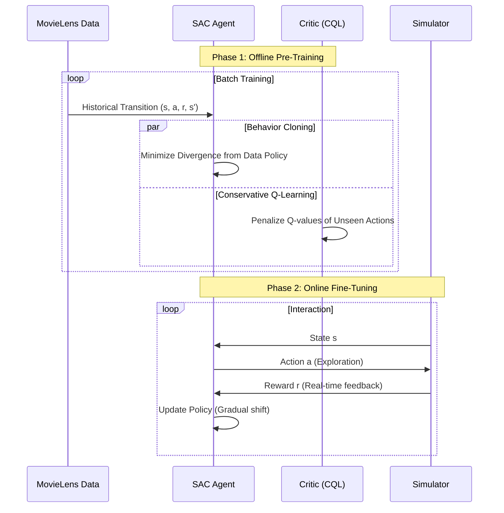
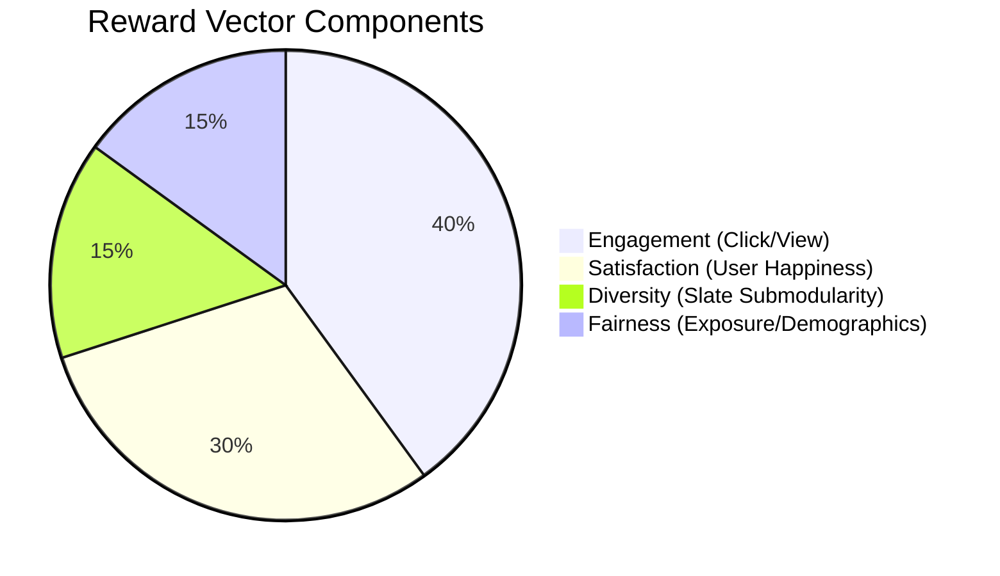

# DOM-RL: Advanced Technical Deep Dive

**Dynamic Multi-Objective Reinforcement Learning with Generative User Simulation**

This document serves as the comprehensive technical reference for the DOM-RL framework. It details the system architecture, the new generative simulation engine, and the advanced reinforcement learning techniques used to solve the multi-objective slate recommendation problem.

---

## 1. System Ecosystem

The DOM-RL framework is composed of two hierarchical agents interacting with a complex user environment. The diagram below illustrates the flow of information and control.

### Visualization: The DOM-RL Control Loop
*This flowchart visualizes the cyclic interaction between the User, the Environment, and the two Agent tiers.*

```mermaid
graph TD
    subgraph "Generative Environment"
        U(("User (Hidden State)")) -->|Signals (Clicks, Hover)| S[State Vector]
        S -->|Observation| WA
        S -->|Observation| SA
    end

    subgraph "Tier 1: Meta-Controller"
        WA[Weight Agent] -- "Distributional RL" --> W[Objective Weights w]
        style WA fill:#f9f,stroke:#333,stroke-width:2px
    end

    subgraph "Tier 2: Policy Agent"
        SA[SAC Agent] -- "Conservative Q-Learning" --> A[Action Index]
        W -->|Conditions| SA
        style SA fill:#bbf,stroke:#333,stroke-width:2px
    end

    subgraph "Slate Engine"
        A -->|Maps to| SL{Slate Tuple}
        SL -->|Items (i1, i2, i3)| U
    end

    U -->|Feedback| R[Base Rewards]
    W -->|Scalarization| FR[Final Reward]
    FR -->|Update| WA
    FR -->|Update| SA
```

**Explanation:**
1.  **User**: Produces noisy signals (clicks, hovers) based on a hidden internal state.
2.  **Weight Agent (Meta-Controller)**: observes the state and determines the optimal balance of business objectives (e.g., "Prioritize Fairness vs. SAT").
3.  **SAC Agent (Policy)**: Takes both the state and the weights to generate a specific action.
4.  **Slate Engine**: Converts the abstract action index into a concrete list of 3 items (Slate) to show the user.

---

## 2. Generative User Simulator (Sim-V2)

We have moved from a heuristic-based simulator to a **Generative Model** that mimics realistic user psychology.

### Visualization: User State Machine
*This state diagram illustrates the internal lifecycle of the simulated user during a single interaction step.*

```mermaid
stateDiagram-v2
    [*] --> LatentUpdate : Agent presents Slate
    
    state "1. Latent Update (GRU)" as LatentUpdate {
        Note: Update hidden mood state h_t based on history
    }
    
    LatentUpdate --> ChoiceModel
    
    state "2. Choice Model (MNL)" as ChoiceModel {
        Note: Evaluate items in Slate
        Note: Probabilistic Selection via Softmax
    }
    
    ChoiceModel --> Dynamics
    
    state "3. Satisfaction Dynamics (SDE)" as Dynamics {
        Note: S_t moves towards Target Sat
        Note: Applies Diffusion Noise (Mood Drift)
    }
    
    Dynamics --> Signals
    
    state "4. Signal Generation" as Signals {
        Note: Generate Click/Hover/Scroll
        Note: Based on 'True Intent' Match
    }
    
    Signals --> [*] : Return Observation
```

**Explanation:**
-   **GRU Core**: The user has a "memory" modeled by a Gated Recurrent Unit neural network.
-   **Choice Model**: The user doesn't just randomly click. They evaluate the slate using a Multinomial Logit model, picking the item that best matches their current intent.
-   **Diffusion**: Satisfaction isn't static. It drifts over time like a random walk (Ornstein-Uhlenbeck process), creating realistic "mood swings".

---

## 3. Offline-to-Online Transfer Pipeline

A key feature of DOM-RL is the ability to pre-train on static datasets (MovieLens) and transfer safely to the online simulator.

### Visualization: The Safety Pipeline
*This sequence diagram shows how a model graduates from offline data to online deployment.*



**Explanation:**
-   **Offline Phase**: We use **Behavior Cloning (BC)** to force the agent to mimic human curators initially. **CQL** ensures the critic doesn't overestimate rewards for actions it hasn't seen in the dataset.
-   **Online Phase**: Once deployed, the agent gradually explores. The constraints (BC/CQL) are relaxed, allowing better-than-human performance.

---

## 4. Fairness and Slate Logic

The rewards and actions have been extended to support ethical AI and complex recommendations.

### Visualization: Reward Composition (Pie Chart)
*This chart breaks down the components of the 4D Reward Vector used in the Multi-Objective MDP.*



**Explanation:**
-   **Engagement**: Standard interaction metrics (CTR).
-   **Satisfaction**: Long-term user retention proxy.
-   **Diversity**: A submodular penalty applied if the items in the slate are too similar (e.g., 3 Action movies).
-   **Fairness**:
    -   *Exposure*: Boosts reward for items that appear in the "Long Tail" (rarely visited).
    -   *Demographic*: Boosts reward for satisfying underserved persona groups (e.g., "Critics").

---

## 5. Implementation Benchmarks

| Feature | Logic | Impact |
| :--- | :--- | :--- |
| **Risk-Awareness** | CVaR (Conditional Value at Risk) | Agent avoids high-variance policies for sensitive users. |
| **Action Space** | Combinatorial ($N \choose K$) | Allows recommending *Bundles* rather than single items. |
| **Simulator** | Stochastic / Diffusion | Prevents the agent from "hacking" a deterministic pattern. |

---
*Generated for DOM-RL Project. Updated 2026-01-30.*
