# DOM-RL v3.0: Advanced Technical Deep Dive

**Dynamic Multi-Objective Deep Reinforcement Learning for Real-Time Recommendation**

This document serves as the comprehensive technical reference for the DOM-RL framework (Paper-Aligned v3.0). It details the hybrid SAC-NSGA-II architecture, granular feature engineering with enriched micro-behavioral signals, 5-objective multi-objective optimization, cold start inference, and full analysis gallery.

---

# Part 1: System Architecture & Logic

## 1. System Ecosystem (Paper IV-E)

The DOM-RL framework is composed of two hierarchical agents interacting with a complex user environment. A **Hybrid SAC-NSGA-II** architecture balances the global exploration of evolutionary algorithms with the adaptive fine-tuning of deep reinforcement learning.

### Visualization: The DOM-RL Hybrid Control Loop

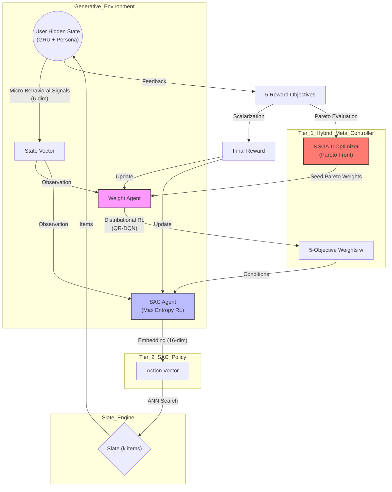

**Key changes from v2.0:**
1. **NSGA-II** now pre-optimizes the weight space, seeding the Weight Agent with Pareto-optimal solutions.
2. **5 Objectives** replace the previous 4: Engagement, Satisfaction, Diversity, Fairness, and **Churn Mitigation**.
3. **6-dim micro-signals** replace the 3-dim signals: scroll velocity, hover-dwell ratio, skip gradient + raw scroll, hover, view time.
4. **Cold Start Phase** infers persona from navigation patterns before any click.
5. **SAC** uses tanh squashing correction and gradient clipping for stability.

---

## 2. Generative User Simulator (Sim-V3, Paper III-A)

The simulator now implements **Granular Feature Engineering (GFE)** with three enriched micro-behavioral signal types:

### Visualization: User State Machine with Micro-Behavioral Signals

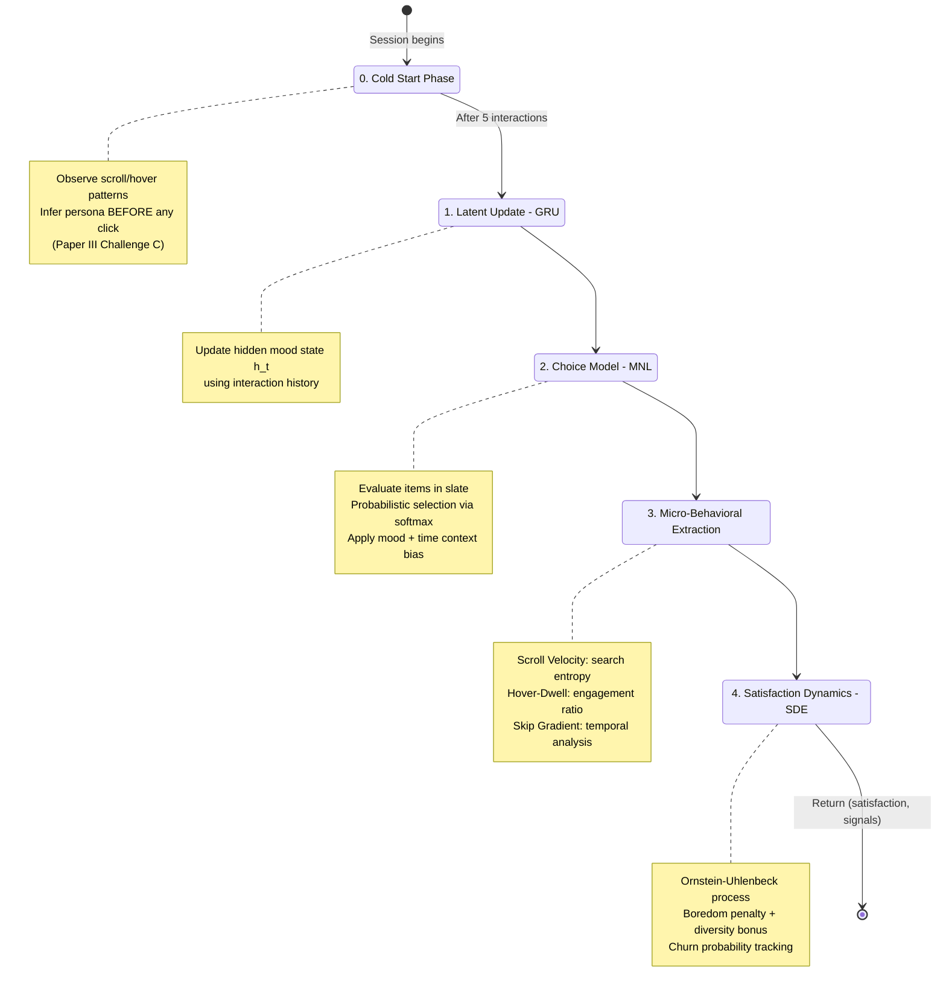

### Paper III-A: Three Signal Types

| Signal | Operational Definition | Code Method | Interpretation |
| :--- | :--- | :--- | :--- |
| **Scroll Velocity** | Rate of vertical navigation (continuous) | `_compute_scroll_velocity()` | High = High-entropy search, Deceleration = Focus |
| **Hover-Dwell Ratio** | Dwell time on card / total session duration | `_compute_hover_dwell()` | High = Active engagement, Low = Passive idle |
| **Skip-Rate Gradient** | Timing-based skip analysis | `_compute_skip_gradient()` | <3s skip = Titular failure, >12s = Content quality |

### Micro-Behavioral Signal Distributions
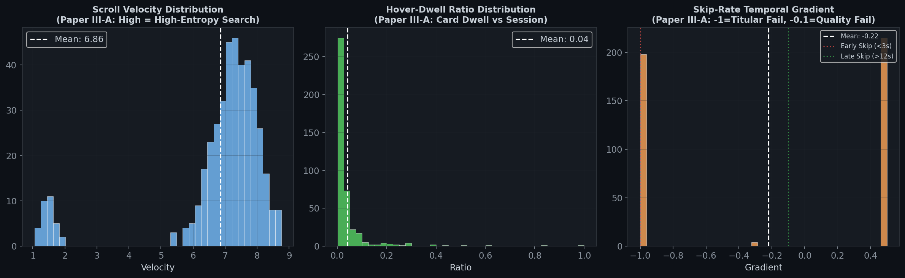
*Left: Scroll velocity distribution (high velocity indicates dissatisfied browsing). Center: Hover-dwell ratio (engagement vs idle). Right: Skip gradient with threshold markers for early vs late skips.*

---

## 3. Multi-Objective Optimization (Paper III-C)

### The 5-Objective Reward Vector

DOM-RL models recommendation as a multi-objective optimization problem to balance short-term engagement with long-term trust.

| Objective | Operational Definition | Primary Metric | Associated Risk |
| :--- | :--- | :--- | :--- |
| **Engagement** | Immediate interaction density | CTR / Watch Time | Algorithmic Fatigue |
| **Satisfaction** | Intent-alignment accuracy | Retention Rate | Delayed Revenue |
| **Diversity** | Genre/Content variety | Coverage Score | Relevance Loss |
| **Fairness** | Persona satisfaction equity | Gap Minimization | Conservative Filtering |
| **Churn Mitigation** | Probability of session termination | Inter-session Interval | Over-cautious |

### Reward Composition Analysis
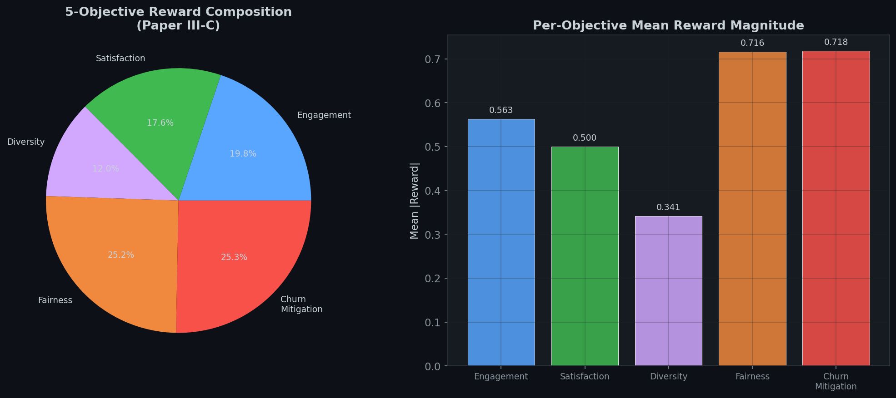
*Left: Proportional contribution of each objective. Right: Mean absolute reward magnitude per objective.*

### 5-Objective Performance Radar
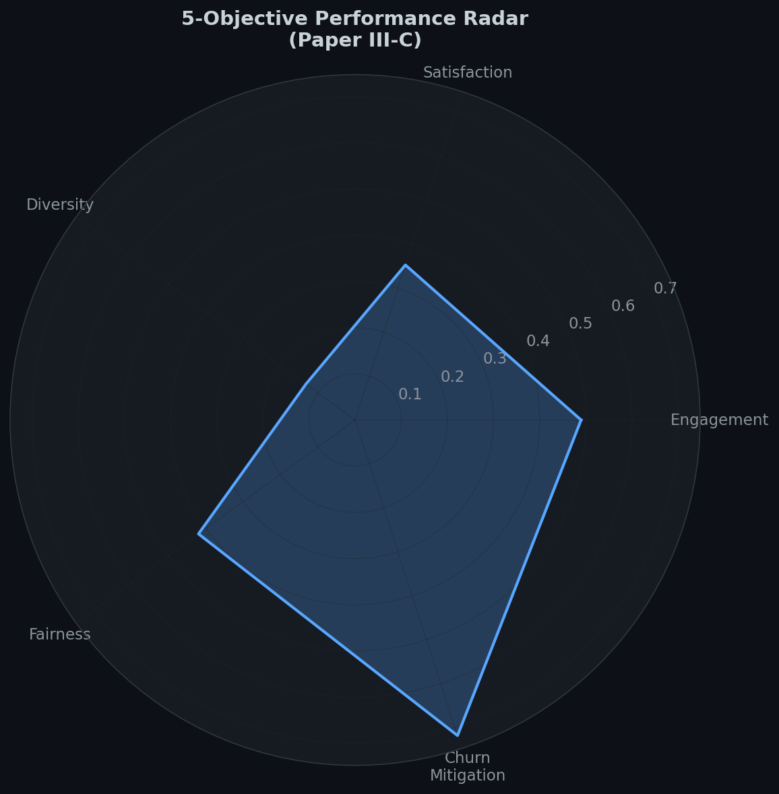
*Normalized radar chart showing the agent's average performance across all 5 objectives.*

---

## 4. NSGA-II: Pareto Optimization (Paper IV-D)

### Visualization: NSGA-II Algorithm Flow

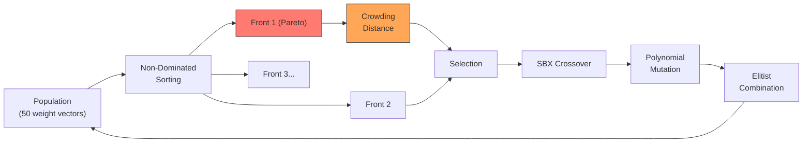

### Pareto Front Projections
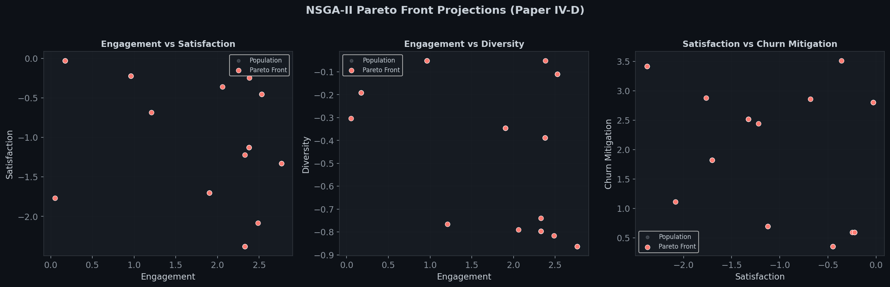
*2D projections of the Pareto front across objective pairs. Red points are non-dominated solutions; grey points are dominated. The agent operates on this frontier to balance conflicting objectives.*

### Weight Population Diversity
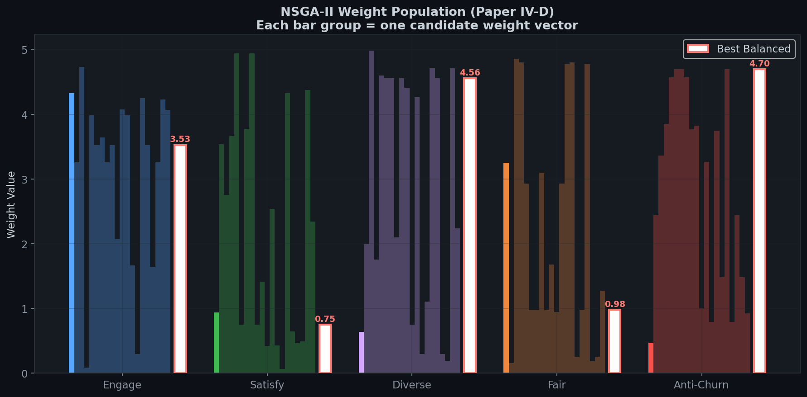
*Bar chart showing the diversity of weight vectors in the NSGA-II population. White bars with red borders indicate the best balanced solution from the Pareto front.*

---

## 5. Cold Start Problem (Paper III, Challenge C)

### The Dynamic Cold Start Solution

Traditional systems require ratings history to function. DOM-RL's Cold Start module infers user persona from **navigation style** within the first 5 interactions:

| Navigation Pattern | Inferred Persona |
| :--- | :--- |
| Fast scroll (>5), low hover (<1.5s) | **Binger** (rapid consumption) |
| Slow scroll (<2), high hover (>2.5s) | **Critic** (careful evaluation) |
| Variable scroll variance (>3.0) | **Browser** (exploring) |
| Default / moderate | **Standard** |

### Cold Start vs Warm Phase Analysis
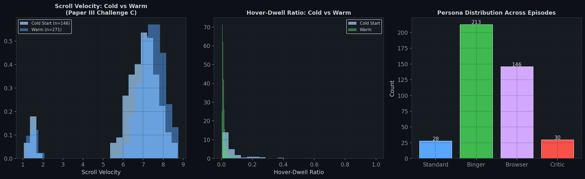
*Left: Scroll velocity distribution during cold start vs warm phase. Center: Hover-dwell ratio comparison. Right: Persona distribution after inference.*

---

# Part 2: Comprehensive Model Analysis (Gallery)

## 6. Signal-Outcome Correlations
Deep correlations between micro-behavioral signals and final outcomes.

### Correlation Matrix
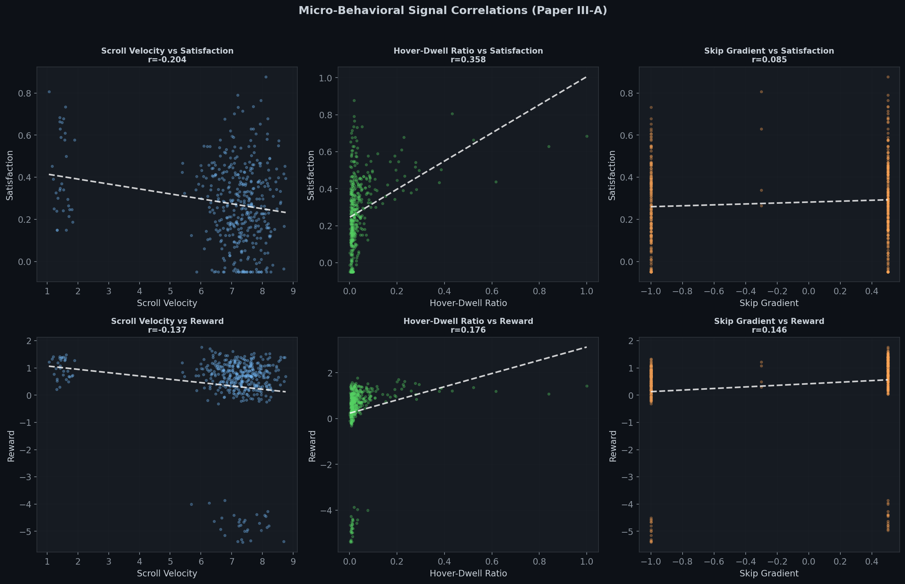
*6-panel correlation analysis. Row 1: Signals vs Satisfaction. Row 2: Signals vs Reward. Each panel shows scatter plot with trend line and Pearson r value.*

**Key Observations:**
- **Scroll Velocity vs Satisfaction**: Expected negative correlation (high velocity = dissatisfied browsing)
- **Hover-Dwell vs Satisfaction**: Positive correlation (engaged users linger)
- **Skip Gradient vs Reward**: Positive correlation (non-skipping produces higher rewards)

---

## 7. Churn Dynamics (Paper III-C)

### Churn Probability Analysis
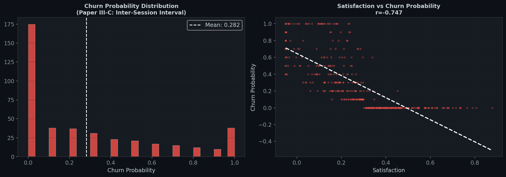
*Left: Distribution of churn probability across all steps. Right: Scatter plot of satisfaction vs churn probability with trend line, confirming the inverse relationship.*

**Mechanism:**
- Consecutive low-satisfaction steps (< 0.3) increase churn probability by 0.1 per step
- Recovery (satisfaction above threshold) gradually decreases churn risk
- The **Churn Mitigation** objective incentivizes the agent to prevent this spiral

---

## 8. Hybrid SAC-NSGA-II Weight Dynamics (Paper IV-E)

### Dynamic Weight Adaptation
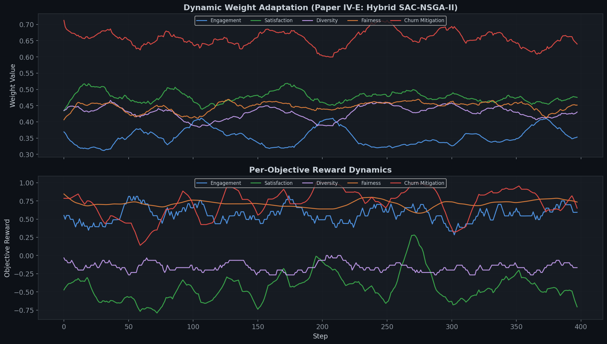
*Top: 5-objective weight adaptation over time (smoothed). The Weight Agent does NOT converge to static weights --- it oscillates to match changing user states. Bottom: Per-objective reward dynamics showing how the system balances competing signals.*

**Critical Insight:** The weights are not static. The hybrid architecture:
1. **NSGA-II** evolves diverse weight populations every 5 episodes
2. **WeightNetwork** refines via gradient descent with Pareto-seeding loss
3. Together they maintain the "Trust Loop" without sacrificing interaction metrics

---

## 9. Episode Case Studies

Detailed step-by-step traces showing all signals, rewards, and weight dynamics within single episodes.

### Trace 1
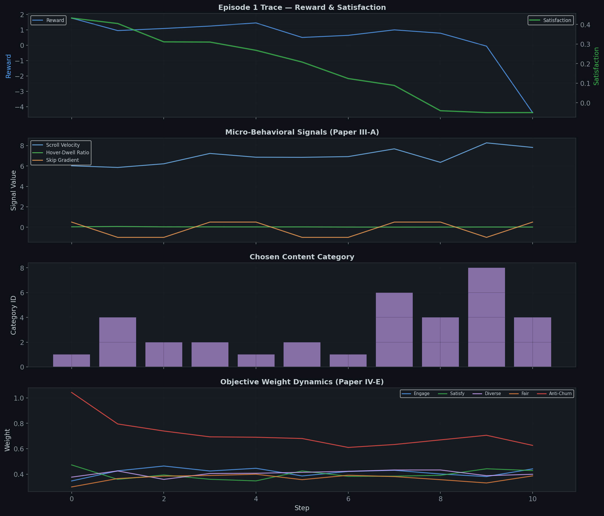
*Panel 1: Reward (blue) and Satisfaction (green). Panel 2: Micro-behavioral signals (scroll velocity, hover-dwell ratio, skip gradient). Panel 3: Chosen content categories. Panel 4: Dynamic 5-objective weight changes.*

### Trace 2
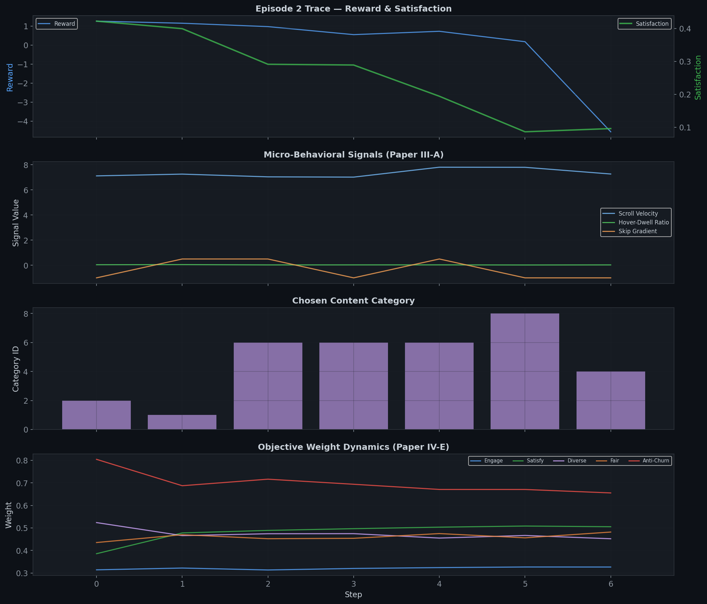
*Observe how scroll velocity spikes correlate with satisfaction dips, and the agent adapts weights in response.*

### Trace 3
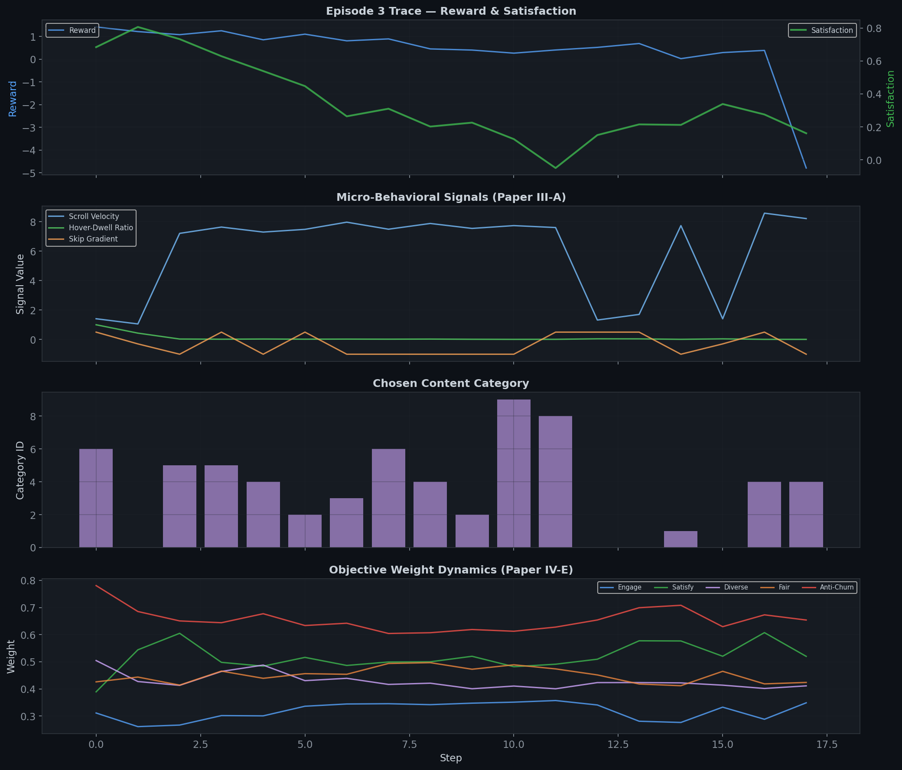
*Example showing the interplay between churn mitigation weight increases during periods of sustained low satisfaction.*

---

## 10. Training Summary

### Episode-Level Training Progress
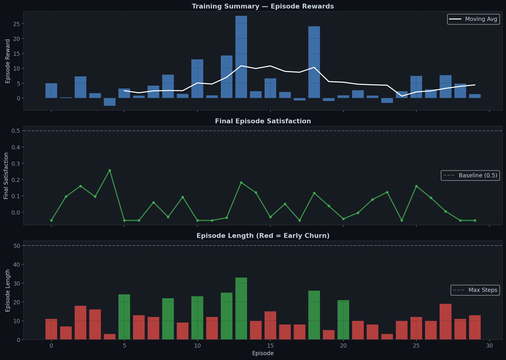
*Panel 1: Episode rewards with moving average. Panel 2: Final satisfaction per episode (baseline = 0.5). Panel 3: Episode length (red bars = early churn, green = full episode).*

---

## 11. Context Awareness

### The Mood-Context Bias Matrix
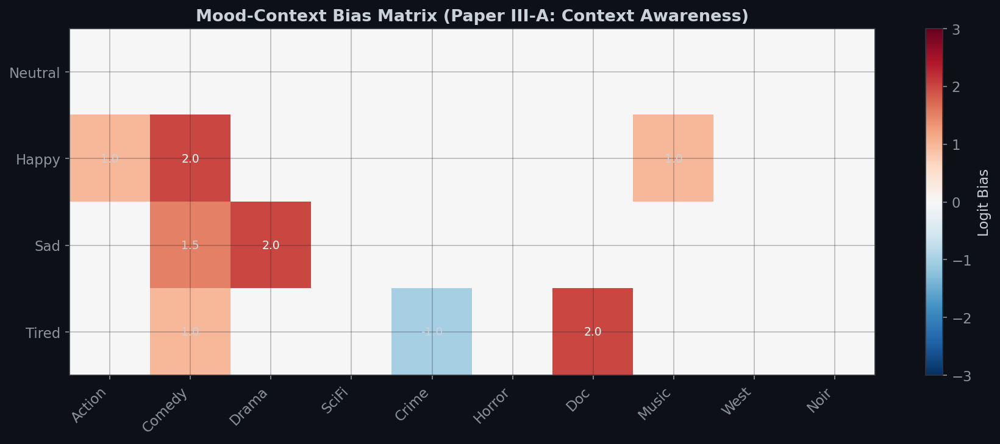
*Heatmap of logit biases applied by the simulator. Red = positive bias (e.g., Happy -> Comedy +2.0), Blue = negative bias (e.g., Tired -> Thriller -1.0). This matrix proves the environment dynamically adapts to user emotional context.*

### User Personas

The environment simulates 4 distinct user archetypes inferred via Cold Start:

| Persona | Behavior Profile | Churn Threshold |
| :--- | :--- | :--- |
| **Standard** | Balanced, moderate engagement | 0.2 |
| **Binger** | High enthusiasm, rapid consumption | 0.1 (more tolerant) |
| **Browser** | High scroll variance, exploration-focused | 0.2 |
| **Critic** | Slow, careful evaluation, hard to satisfy | 0.3 (least tolerant) |

---

## 12. SAC Algorithm Details (Paper IV-A, IV-B)

### Architecture Summary

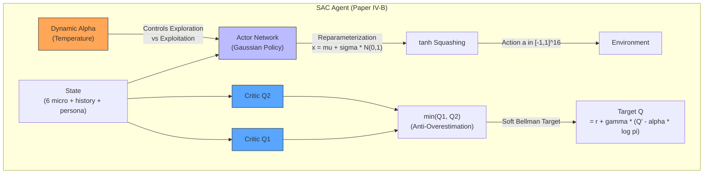

### Key Formulae

| Component | Formula | Paper Reference |
| :--- | :--- | :--- |
| **Objective** | J(pi) = Sum E[r(s,a) + alpha * H(pi)] | Paper IV-A Eq. 1 |
| **Soft Bellman** | Q(s,a) = r + gamma * E[Q(s',a') - alpha * log pi(a'\|s')] | Paper IV-B Eq. 2 |
| **tanh Correction** | log pi -= log(1 - tanh(x)^2 + eps) | Paper IV-B |
| **Alpha Loss** | -alpha * (log pi + H_target) | Paper IV-A |
| **Target Entropy** | H_target = -log(1/\|A\|) * 0.98 | Paper IV-A |

---

*Generated for DOM-RL Project v3.0 (Paper-Aligned). Updated 2026-02-27.*
*Plot source: `generate_plots_v3.py` | Verification: `verify_v3.py` (ALL TESTS PASSED)*
